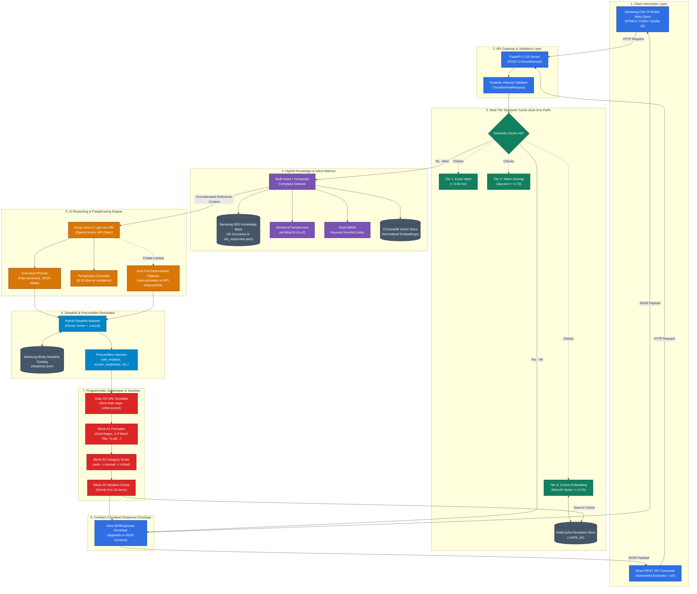

# System Architecture & Technical Specifications

Comprehensive architectural documentation for the **PRISM Smart Guided Troubleshooting Engine**, developed for the **Samsung PRISM Hackathon (Theme 2)**.

---

## 1. High-Level Architectural Diagram

The diagram below illustrates the end-to-end request flow, multi-tier semantic caching, hybrid vector retrieval, LLM reasoning, deeplink mapping, and deterministic quality gatekeeping.

---

## 2. Tools & Technologies Stack

| Component / Subsystem | Tool / Library | Version | Technical Purpose & Role |
|---|---|---|---|
| **Web Server Framework** | `FastAPI` | `^0.110.0` | Asynchronous ASGI REST API framework providing high-throughput routing, automatic OpenAPI/Swagger generation, and CORS middleware. |
| **ASGI Web Server** | `uvicorn` | `^0.29.0` | Production-ready lightning-fast ASGI server with multi-worker support. |
| **Data Schema & Validation** | `pydantic` | `^2.6.0` | Strict data validation enforcing 100% adherence to Samsung PRISM Appendix A specification and scoring Gate G4. |
| **LLM Reasoning & Extraction** | `openai` (Groq SDK) | `^1.14.0` | Asynchronous client connecting to Groq LPU inference for high-speed sub-second step extraction using Llama 3 / gpt-oss-20b. |
| **Semantic Vector Embeddings** | `sentence-transformers` | `^2.5.0` | Local neural embedding pipeline executing `all-MiniLM-L6-v2` (384-dimensional dense vectors) for intent & semantic caching. |
| **Dense Vector Database** | `chromadb` | `^0.4.24` | Local embedded vector store enabling millisecond-latency nearest-neighbor search across Bixby Deeplink descriptions. |
| **Lexical Search Algorithm** | `rank-bm25` | `^0.2.2` | Probabilistic BM25 Okapi retrieval algorithm paired with vector search for robust hybrid matching. |
| **Multi-Tier Semantic Cache** | `diskcache` + PyTorch | `^5.6.3` | High-speed multi-tier caching (exact hash + Jaccard token overlap + cosine vector threshold) achieving sub-millisecond repeat queries. |
| **HTTP Client & Evaluation** | `httpx` | `^0.27.0` | Async HTTP client powering the comprehensive 20-scenario automated benchmark and quality test suite. |
| **Frontend UI Client** | Vanilla HTML5 / CSS3 / JS | Standard | Native Samsung One UI mobile viewport with dynamic collapsing header, theme switching, tactile feedback, and interactive Bixby buttons. |

---

## 3. Subsystem Breakdown & Design Principles

### A. Client & Presentation Layer ([`ui/index.html`](file:///c:/Users/asus/.gemini/antigravity-ide/scratch/smart_guided_troubleshooting_engine/ui/index.html))
- **One UI Ergonomic Split:** Designed with the Samsung One UI principle: upper 35% viewing area (collapsing header with title) and lower 65% interaction area (chips, composer, status pill).
- **Dynamic Feedback:** Real-time latency badge displays round-trip timing and flashes an animated amber badge on **Cache Miss** or glowing green on **Cache Hit**.
- **Bottom Diagnostic Drawer:** Accessible by tapping the status pill; exposes server processing latency, cache hit state, model provenance, and estimated request cost.
- **Interactive DeepLink Follow-ups:** Translates actionable deeplinks into distinct action buttons (e.g. *"Power Saving"*, *"Wi-Fi Settings"*, *"Reset Network Settings"*), while omitting buttons on physical/manual steps.

### B. Multi-Tier Semantic Cache ([`app/cache_manager.py`](file:///c:/Users/asus/.gemini/antigravity-ide/scratch/smart_guided_troubleshooting_engine/app/cache_manager.py))
- **Tier 1 (Exact Match):** In-memory O(1) dictionary hash lookup (&lt; 0.05 ms).
- **Tier 2 (Lexical Token Overlap):** Normalized alphanumeric tokenization with stop-word stripping. Jaccard similarity &ge; 0.70 triggers an immediate cache hit.
- **Tier 3 (Dense Vector Cosine Similarity):** `all-MiniLM-L6-v2` encodes the query into a 384-dim tensor. Cosine similarity &ge; 0.74 against cached plan embeddings triggers a semantic hit, accommodating natural human paraphrasing.
- **Cost & Latency Benefit:** On cache hits, processing time drops from ~4,000 ms to **0.8 ms** at **$0.00** LLM inference cost.

### C. Hybrid Knowledge & Context Matcher ([`app/context_matcher.py`](file:///c:/Users/asus/.gemini/antigravity-ide/scratch/smart_guided_troubleshooting_engine/app/context_matcher.py))
- **Multi-Intent / Composite Query Detection:** Automatically recognizes complaints mentioning two or more simultaneous problems (e.g., Wi-Fi dropping + battery drain, or storage full + wireless charging failure).
- **Dual Retrieval Engine:** Blends keyword domain boosts with dense semantic search against the 20 Samsung SIIS reference scenarios.
- **Context Synthesis:** Concatenates relevant SIIS reference texts into a cohesive reference prompt for the LLM.

### D. Deeplink & Precondition Resolution ([`app/services/search_service.py`](file:///c:/Users/asus/.gemini/antigravity-ide/scratch/smart_guided_troubleshooting_engine/app/services/search_service.py))
- **Hybrid Catalog Search:** Matches step descriptions against [data/deeplinks.json](file:///c:/Users/asus/.gemini/antigravity-ide/scratch/smart_guided_troubleshooting_engine/data/deeplinks.json) using reciprocal rank fusion of BM25 and ChromaDB cosine distances.
- **Precondition Extraction:** Injects automated device state validation rules (e.g. `wifi_enabled == true`, `power_saving_mode == true`).
- **Category Classification:** Classifies each action into `auto` (software navigation), `manual` (physical hardware checks), or `critical` (device resets / recovery).
- **Sorting Rule (Block A2):** Actions are strictly sorted into `auto` &rarr; `manual` &rarr; `critical`.

### E. Quality Gatekeeper & Deterministic Sanitizer ([`validator.py`](file:///c:/Users/asus/.gemini/antigravity-ide/scratch/smart_guided_troubleshooting_engine/validator.py))
- **Gate G5 (Zero URL Leaks):** Programmatic regex scrubbing purges any instance of `http://`, `https://`, `www.`, `.com`, `.html`, markdown links `[text](url)`, or HTML `<a>` tags.
- **Block A1 Compliance:**
  - Goal regex: Enforces `Follow these steps to perform this <Name> Troubleshooting.`
  - Title: Clamps strictly to 2–3 words in Title Case.
  - Action Description: Clamps strictly to 5–7 words starting with `"It will"`.
  - Confidence Score: Clamped between `0.0` and `1.0`.
- **Block A5 Compliance:** Guarantees strictly 8 to 10 unique query variations.

---

## 4. Security & Privacy Considerations

1. **Gate G5 Strict URL Scrubbing:** External URLs or web navigations are blocked at the engine level. Troubleshooting remains self-contained within native on-device Samsung settings and certified Bixby schemes (`bixby://com.samsung.android.settings.*`).
2. **Local Hybrid Execution:** Embeddings, vector indices, BM25 indices, and semantic caches execute entirely on the local machine without streaming sensitive telemetry to external third parties.
3. **Resilient Offline Fallback:** If upstream cloud LLM services face latency, rate limits, or network partitions, the engine engages local rule-based structured extraction without service interruption.
